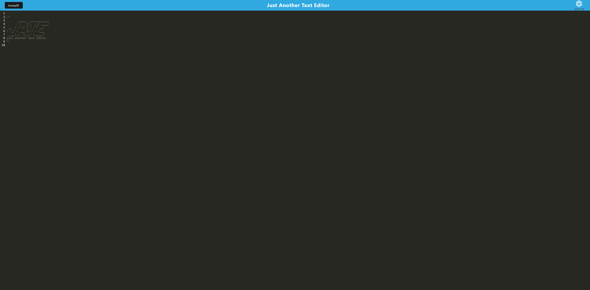

# Text Editor Web Application

## Description
This application is a text editor with client-server architecture, featuring modern JavaScript capabilities, service workers, and IndexedDB for offline functionality.

## Installation
Clone the repository and install dependencies:
git clone
cd your-repository
npm install

## Usage
To start the application:
npm run start
This command starts the backend server and serves the client application.

## Features
- Bundling JavaScript files using Webpack.
- Generated HTML file, service worker, and manifest file using Webpack plugins.
- Compatibility with next-gen JavaScript.
- IndexedDB for immediate database storage creation and persistent content storage.
- Installable as a desktop web application.
- Registered service worker using Workbox for offline functionality and asset caching.

## Building for Deployment
For deployment on platforms like Render, ensure to configure the build scripts in `package.json` for a Webpack application.

## Contributing
Contributions are welcome. Please open an issue first to discuss what you would like to change.

## Photos

